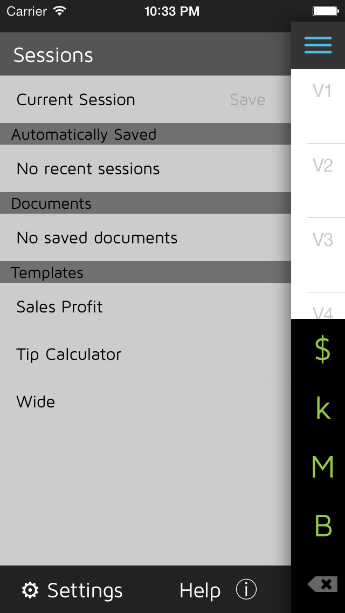

Paribus Templates
=========

This is a public repository of templates for [Paribus Calculator](http://www.paribuscalc.com/?source=github/paribus_templates).

This project allows you contribute to the Paribus community.

1. Clone this repository
2. Add your own templates or changes to existing templates
3. Create a pull request

Thank you for your help making Paribus better for everyone.

You may contact <support@paribuscalc.com> with questions.

File Format
===========

The Paribus file format ends with the extension `.botn`. *Historical note: the product code name was "back of the napkin".*

The filename is used for display in the sessions menu. Templates are sorted alphabetically and any `_` characters are converted to spaces.

Here is an example template:

    [BOTN]
    title:Tip Calculator
    v1.label:Total
    v1:$
    v1.focus:True
    v2.label:15%
    v2:v1 * 15%
    v3.label:18%
    v3:v1 * 18%
    v4.label:20%
    v4:v1 * 20%

The file consists of name/value pairs, one per line, that are basically instructions to the calculator.

`v1` sets the value of `v1`. You may include a simple value or an equation.

`v1.label` sets the row label to `Total`

`v1.focus` tells the UI to focus on `v1` to prompt data entry by the user.

